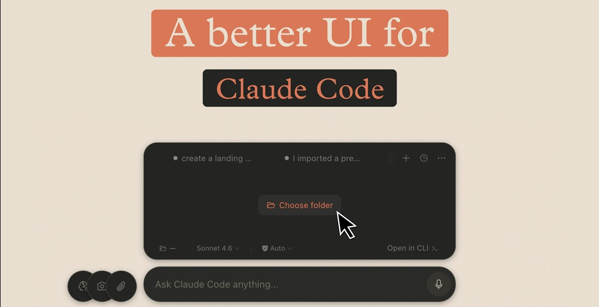

<div align="center">


# CCF — Claude Code Floating

**Linux 桌面端 Claude Code CLI 悬浮窗**

<a href="README.md">🇺🇸 English</a> &nbsp;|&nbsp; 🇨🇳 中文

[](https://github.com/baozitao/ccf/stargazers)
[](LICENSE)
[](https://github.com/baozitao/ccf/releases)
[](https://github.com/baozitao/ccf)
[](https://www.electronjs.org/)
[](CONTRIBUTING.md)

<br/>

*不要再把终端藏起来了。让它悬浮在桌面上。*

</div>

<hr/>

<div align="center">



</div>

---

## CCF 是什么？

**CCF（Claude Code Floating）** 是一个始终置顶的透明悬浮窗，将 Claude Code CLI 包裹在精美的桌面 UI 中。按 `F3` 呼出/收起，拖拽到任意位置，多标签管理会话，不用时一键隐藏——完全不打断你的工作流。

本项目 Fork 自 Lucas Couto 的 [clui-cc](https://github.com/lcoutodemos/clui-cc)（MIT 协议）。原项目仅支持 macOS，本 Fork 将其带到了 **Linux（GNOME / Wayland / XWayland）**，并增加了更多功能。

---

## ⚡ 快速安装

### 下载 .deb 包（推荐）

```bash
# 下载最新版本
wget https://github.com/baozitao/ccf/releases/latest/download/ccf_latest_amd64.deb

# 安装
sudo dpkg -i ccf_*_amd64.deb

# 启动
ccf
```

### 一键安装脚本

```bash
curl -fsSL https://raw.githubusercontent.com/baozitao/ccf/main/scripts/install.sh | bash
```

---

## 🤖 AI 助手安装提示词

把这一行指令交给 Claude Code 或 OpenCode，自动完成 CCF 的安装配置：

```
从 https://github.com/baozitao/ccf 安装 CCF——从 releases 下载最新 .deb 包，用 dpkg 安装，然后在 GNOME 中设置 F3 全局快捷键执行 `ccf --toggle`。
```

---

## ✨ 功能特性

| | 功能 | 说明 |
|---|------|------|
| 🪟 | **悬浮覆盖窗** | 透明、始终置顶，不挡你的视线 |
| ⌨️ | **F3 全局唤起** | 通过 GNOME 快捷键从桌面任意位置呼出/隐藏 |
| 🖱️ | **右键拖拽** | 在空白区域右键拖动窗口到任意位置 |
| 📐 | **动态尺寸** | 窗口随内容自动伸缩，隐藏时自动收起 |
| 🗂️ | **标签管理** | 多会话标签，支持重命名、删除、拖拽排序 |
| 📜 | **历史会话** | 浏览、恢复、删除历史 Claude Code 对话 |
| 🎤 | **语音输入** | 通过本地 Whisper（`small` 模型）实现语音转文字，无需 GPU |
| 📸 | **截图** | 集成 `gnome-screenshot` 直接截取屏幕 |
| 🛒 | **技能市场** | 浏览并安装来自 GitHub 的 Claude Code 斜杠命令插件 |
| 🔒 | **权限审批 UI** | 在工具调用执行前，以可视化界面审批或拒绝 |
| 🎨 | **双主题** | 深色/浅色模式，支持跟随系统自动切换 |
| 🖥️ | **在终端中打开** | 一键在 `gnome-terminal` 中打开当前工作目录 |

---

## 🐧 Linux 与 macOS 对比

| 功能 | macOS（原版） | Linux / CCF（本 Fork） |
|------|-------------|----------------------|
| 全局快捷键 | `⌥ 空格` | `F3`（GNOME 自定义快捷键） |
| 截图 | `screencapture` | `gnome-screenshot` |
| 终端 | Terminal.app | `gnome-terminal` |
| 窗口异形裁剪 | macOS 原生 | Electron `setShape` API |
| 语音 / Whisper | `brew install whisper-cli` | `pip install openai-whisper` |
| 发行包格式 | `.dmg` / `.app` | `.deb`（Ubuntu/Debian） |
| Wayland 支持 | — | XWayland 兼容 |

---

## ⌨️ 快捷键

| 快捷键 | 功能 |
|--------|------|
| `F3` | 全局切换 CCF 窗口（需在 GNOME 中设置） |
| `Esc` | 隐藏 CCF 窗口 |
| `Ctrl + T` | 新建标签 |
| `Ctrl + W` | 关闭当前标签 |
| `Ctrl + Tab` | 切换到下一个标签 |
| `Ctrl + Shift + Tab` | 切换到上一个标签 |
| `Ctrl + L` | 清空当前会话 |
| `Ctrl + H` | 打开历史会话 |

---

## 📋 前置要求

- **操作系统**：Ubuntu 22.04+／基于 Debian 的 Linux，GNOME 桌面环境
- **Node.js**：>= 18（[nodejs.org](https://nodejs.org/)）
- **Claude Code CLI**：已安装并完成认证

  ```bash
  npm install -g @anthropic-ai/claude-code
  claude auth login
  ```

- **可选**：`gnome-screenshot`（截图功能）
- **可选**：`whisper`（语音输入）

  ```bash
  pip install openai-whisper
  ```

---

## 🔨 从源码构建

```bash
# 克隆仓库
git clone https://github.com/baozitao/ccf.git
cd ccf

# 安装依赖
npm install

# 开发模式（热重载）
npm run dev

# 打包 .deb
npm run build:linux

# 或者不打包直接运行
./commands/start-linux.sh
```

### GNOME F3 快捷键设置

进入 **设置 → 键盘 → 自定义快捷键**，添加：

| 字段 | 值 |
|------|-----|
| 名称 | CCF Toggle |
| 命令 | `ccf --toggle` |
| 快捷键 | `F3` |

---

## 🏗️ 工作原理

```
用户输入
    │
    ▼
CCF Electron UI
    │
    ├─ 渲染进程（React UI、标签页、历史记录）
    │
    └─ 主进程
         │
         ├─ 启动：claude -p  ──► NDJSON 流 ──► 实时渲染
         │
         └─ 工具调用？──► 权限审批 UI ──► 允许 / 拒绝
```

---

## 🤝 参与贡献

欢迎提交 PR！无论是 Bug 修复、新功能还是文档完善，都非常欢迎。

1. Fork 本仓库
2. 创建你的分支：`git checkout -b feat/my-feature`
3. 提交变更：`git commit -m 'feat: 添加新功能'`
4. 推送：`git push origin feat/my-feature`
5. 发起 Pull Request

提交前请阅读 [CONTRIBUTING.md](CONTRIBUTING.md)。

---

## 🙏 致谢

- 原始项目：**[clui-cc](https://github.com/lcoutodemos/clui-cc)**，作者 [Lucas Couto](https://github.com/lcoutodemos)（MIT 协议）
- 灵感来源：Anthropic 的 [Claude Code](https://docs.anthropic.com/en/docs/claude-code)
- Linux 移植及功能扩展：[baozitao](https://github.com/baozitao)

---

## 📄 许可证

MIT © [baozitao](https://github.com/baozitao) — 详见 [LICENSE](LICENSE)

本项目 Fork 自 [clui-cc](https://github.com/lcoutodemos/clui-cc)（MIT），保留原版权声明。

---

<div align="center">

用 ☕ 和 Claude Code 制作 · <a href="README.md">🇺🇸 View in English</a>

</div>
